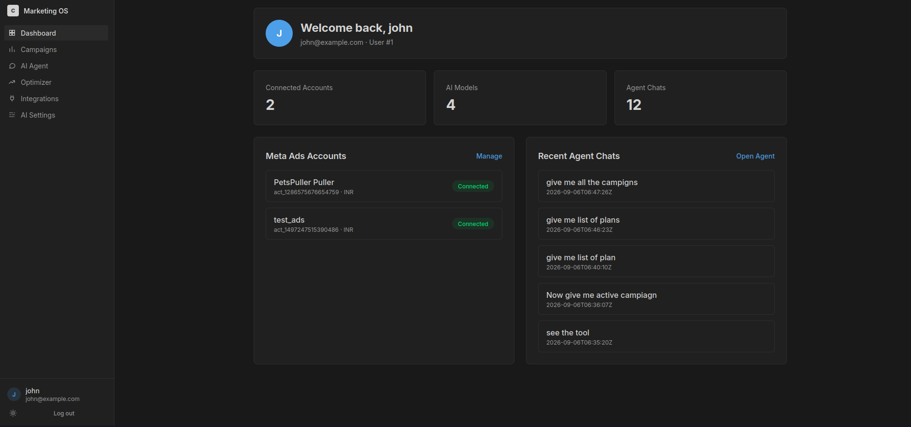
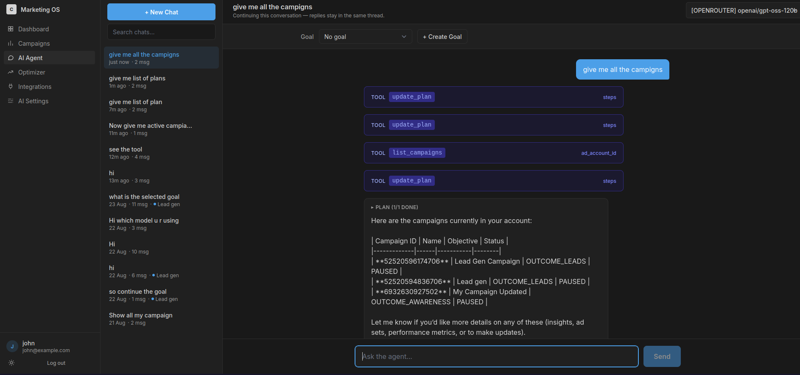
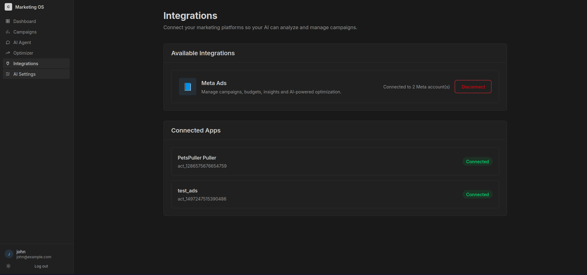

# CBK — Marketing OS

AI-powered advertising management platform for Meta Ads — connect accounts, chat with an autonomous agent, and optimize campaigns with human-approved guardrails.



> **Latest screenshot:** Dashboard overview — connected Meta Ads accounts, agent chat history, and account rollup (`Screenshots/Screenshot_2026-09-06_12-19-10.png`).

---

## What is CBK?

1. **Connect Meta Ads** via OAuth — multiple ad accounts per user.
2. **Add AI providers** (Google Gemini or OpenRouter) with per-user API keys.
3. **Chat with an autonomous agent** that answers questions and executes ad operations through function calling — always behind human approval.
4. **Analytics intelligence** converts raw Meta insights into normalized metrics, scores, health, anomalies and goal progress.
5. **Decision engine** turns intelligence into concrete actions (`PAUSE_CAMPAIGN`, `DECREASE_BUDGET`, …) gated by approval + hard guardrails.

**Golden rule:** the system may *propose* anything but may only *execute* what an `APPROVED` proposal authorizes — and even then only through the guardrail-checked executor.

---

## Features

### Auth & Users
- Register / Login / Refresh / Logout with JWT HS256 (1h access + 30d HttpOnly `refresh_token` Lax cookie)
- `GET /me` profile, `AuthMiddleware` Bearer enforcement, per-request `user_id` SQL scoping

### Meta Ads Integration
- OAuth: `GET /auth/meta/credential` (app secret never leaves server) → `POST /auth/meta/callback` code exchange → auto-discovers `act_*` accounts
- `GET /auth/meta/accounts` (token stripped `json:"-"`), `DELETE /auth/meta/accounts`, `GET /meta/rate-limit/status`

### AI Providers
- Per-user keys stored server-side, never returned: `POST /providers {model_name, api_key, provider_type: GEMINI|OPENROUTER}`, `GET /providers`, `DELETE /providers/{id}`, `POST /ai/generate`

### Marketing Goals
- CRUD + lifecycle: `POST /goals`, `GET /goals[?status]`, `GET/PATCH/DELETE /goals/{id}`, `POST /goals/{id}/pause|activate|complete`
- Structured targets `target_cpl/cpa/roas/conversions, budget, daily_budget, start/end_date` + prose `description` for LLM

### Autonomous Agent (ReAct Loop)
- `GOAL → PLAN(update_plan) → ACTION → OBSERVATION → DECISION ×≤15 → COMPLETION`
- `POST /agent/chat` (REST) and `POST /agent/chat/stream` (SSE `iteration/plan/action/observation` + `final`)
- Goal injection via `ContextBlocks` (`goal ≠ instruction`), 28 Meta tools + internal `update_plan`, full `trace[]` + flat `steps[]` persisted
- History: `GET /agent/sessions`, `POST /agent/sessions`, `GET /agent/sessions/{id}/messages`, `PATCH/DELETE /agent/sessions/{id}`

### Dashboard Browsing (human-paced reads)
- `GET /meta/campaigns`, `/meta/campaign/details`, `/meta/campaign/insights`, `/meta/adsets`, `/meta/ads`

### Analytics Intelligence
- Normalized `Metrics` (spend, impressions, reach, clicks, CTR%, CPC, CPM, frequency, leads/purchases, conversions, CVR%, CPL, CPA, ROAS) via `NormalizeInsight` + `DeriveRatios`
- `ScorePerformance` (0-100), `AssessHealth` (HEALTHY/WATCH/CRITICAL/NOT_DELIVERING/PAUSED), `AssessBudgetEfficiency`, `AssessFatigue`, `DetectAnomalies` (≥2σ), `TrendDirections`, `AssessGoalProgress`
- Endpoints: `GET /analytics/overview|/campaigns|/adsets|/ads|/trends|/anomalies|/compare|/recommendations`

### Decision & Optimization Loop
- Rules (highest confidence wins): `not_delivering→PAUSE`, `cpa/cpl/roas_above_target→cut/pause`, `zero_result_spend→-30%`, `creative_fatigue→REFRESH_CREATIVE`, `high_performer_underpaced→+20%`, `healthy_keep→NO_ACTION`
- `POST /optimization/generate?level=campaigns|adsets` → `PENDING` proposals (deduped), `POST /optimization/simulate` (dry-run + `estimated_daily_impact` + `risk`), `GET /optimization/actions`, `POST .../approve|reject|execute`, `GET .../actions/{id}` audit, `GET /optimization/outcomes|/performance|/effectiveness`

### Guardrails & Execution
- `MaxIncrease 20%`, `MaxDecrease 30%`, `MinConversionsForScale 5`, `MinDataDays 7`, `Cooldown 24h`; live Meta status/budget check, per-object lock, idempotency + DB unique index

### Rate-Limit Protection (`internals/metaclient`)
- Token bucket 60/min burst 10 per token, global concurrency 4, usage-header tracking (>70% slow lane, ≥90% self-block), circuit breaker 30s→15min doubling, retry ≤3 with jitter, GET cache 45s + singleflight

### Frontend (SvelteKit 5 + Tailwind 4, submodule `ui/ui` branch `dev`)
- `/(public)/` landing (auth-aware: shows `Go to Dashboard` when logged in, not `Sign in`) + `auth/login` (tabbed sign-in/register)
- `/(app)/` shell (`AppShell.svelte`): `dashboard/` overview + campaigns, `chat/` SSE streaming + history + goal bar + model selector, `settings/ai`, `auth/meta`, `optimization/` (Overview/Approvals/Simulator/History + effectiveness scorecard), `api/meta/callback`
- Svelte 5 runes, `apiFetch` with auto Bearer + credentials, `svelte-check` clean

---

## Tech Stack

| Layer | Choice |
|---|---|
| Language | Go 1.26.3 |
| Router | `go-chi/chi/v5` + cors |
| Database | SQLite `modernc.org/sqlite` (pure Go, WAL + busy_timeout 5000) |
| Auth | JWT HS256 `golang-jwt/v5` + bcrypt |
| AI | Gemini `generativelanguage.googleapis.com/v1beta` + OpenRouter `openrouter.ai/api/v1` |
| Frontend | SvelteKit 5 + Tailwind 4 |
| Config | `.env` via `joho/godotenv` |

---

## Quick Start

```bash
# 1. Clone (with frontend submodule)
git clone https://github.com/mrigangha/cbk.git
cd cbk
git submodule update --init --recursive # if ui/ui empty

# 2. Env
cp .env.example .env
# Edit .env:
# GEMINI_API_KEY=...        # seed/tests only, user keys live in DB
# JWT_SECRET=change-me
# META_APP_ID=...
# META_APP_SECRET=...
# META_CALLBACK_URL=http://localhost:5173/api/meta/callback

# 3. Migrations (idempotent v1→v9)
go run ./migrations

# 4. Backend on :3000
go run ./cmd/serve

# 5. Frontend on :5173
cd ui/ui && npm install && npm run dev
```

CORS allows `http://localhost:5173` with credentials. No global timeout — SSE/agent runs are long-lived.

### Quality Gates

```bash
go build ./... && go vet ./... && go test ./...
cd ui/ui && npm run check && npm run build
go run ./cmd/toolcheck # live read-only Meta tool validation
```

---

## Environment Variables

```
GEMINI_API_KEY        # seed/tests only
JWT_SECRET
META_APP_ID
META_APP_SECRET       # never exposed via API
META_CALLBACK_URL
```

---

## Screenshots

| Dashboard | Description |
|---|---|
|  | Latest — Dashboard overview (Welcome back, Connected Accounts 2, AI Models 4, Agent Chats 12, Meta Ads Accounts, Recent Agent Chats) |
|  | Campaigns / accounts view |
|  | Agent / Optimizer flow |

`Screenshots/` is tracked in git — add new captures with timestamp `Screenshot_YYYY-MM-DD_HH-MM-SS.png`.

---

## API Surface (Summary)

```
POST /auth/register, /auth/login, /auth/refresh, /auth/logout
GET  /me
POST /providers, GET /providers, DELETE /providers/{id}
POST /ai/generate
GET  /auth/meta/credential, POST /auth/meta/callback, GET /auth/meta/accounts, DELETE /auth/meta/accounts
GET  /meta/campaigns, /meta/campaign/details, /meta/campaign/insights, /meta/adsets, /meta/ads, /meta/rate-limit/status
POST /agent/chat, POST /agent/chat/stream
GET  /agent/sessions, POST /agent/sessions, GET /agent/sessions/{id}/messages, PATCH/DELETE /agent/sessions/{id}
POST /goals, GET /goals[?status], GET/PATCH/DELETE /goals/{id}, POST /goals/{id}/pause|activate|complete
GET  /analytics/overview, /analytics/campaigns, /analytics/adsets, /analytics/ads, /analytics/trends, /analytics/anomalies, /analytics/compare, /analytics/recommendations
POST /optimization/generate, POST /optimization/simulate, GET /optimization/actions, POST /optimization/actions/{id}/approve|reject|execute, GET /optimization/actions/{id}, GET /optimization/outcomes, GET /optimization/performance, GET /optimization/effectiveness
```

---

## Project Structure

```
cmd/serve, cmd/toolcheck, cmd/db (scratch)
migrations/1.go..9.go  # register in 1.go migrators slice
internals/core/        # handlers + wiring
internals/agent/       # ReAct runtime
internals/ai/cloud/    # provider abstraction
internals/analytics/   # normalization + intelligence
internals/optimization/# decision engine + evaluator
internals/metaclient/  # Graph choke point
internals/tools/       # 28 tool registry + Meta CRUD
ui/ui/                 # SvelteKit frontend (submodule)
Screenshots/           # UI captures
```

Database after migrations: `users`, `providers`, `meta_ads_accounts`, `agent_sessions`, `agent_messages`, `marketing_goals`, `optimization_actions`, `optimization_outcomes`.

---

## Security Invariants

1. Meta tokens / app secrets never in API responses (`json:"-"`)
2. User API keys never returned after creation
3. Every object op verifies `user_id` ownership
4. No auto-execution — approval gate + guardrails are architectural
5. Parameterized SQL only

---

## License

Private — all rights reserved. For internal use.
